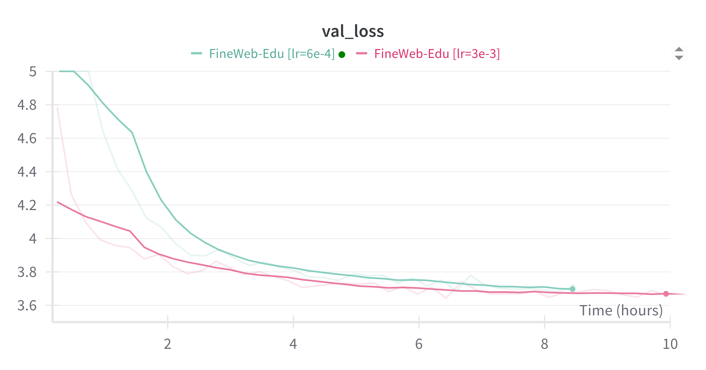

# Decoder-Style Language Models from the ground up

## Introduction
As language models are increasingly used in applications that go far beyond simple next-token prediction, understanding them from first principles is incredibly useful. While modern pre-trained models are highly adaptable, high-level APIs often obscure the core mechanics and insights into their behavior, limitations, and optimization. This project is a complete implementation and framework built from the ground up to provide the understanding to adapt these models to novel tasks.

I built the framework's key components from scratch—including the GPT-2 model architecture, the training loops, and the evaluation pipeline—and developed modular components to analyze model behavior under different hyperparameters. I built this using the open-source stack (PyTorch, Weights & Biases, Hugging Face) to implement these ideas on the toolset used by most of the AI community, contrasting with my experience in Google's TensorFlow and JAX ecosystem.

To show what we can learn by diving deep into the stack, I pre-train a custom GPT-2 model, visualize its attention weights to interpret its behavior, and show how it can be aligned for a specific task.

update 1: During model evaluation, I discovered an interesting challenge: the original Toronto Open Book Corpus has been lost and is now only available in lowercase with punctuation removed. Could I train a model to restore the original text?

update 2: As mentioned in my [Evaluation Analysis](#Out-of-Sample Evaluation), the preprocessing of the BERT corpus makes it difficult for an LLM trained with this dataset to generalize to other corpora. To understand how a dataset with full punctuation impacts model performance, I'm retraining using Fineweb-Edu. It will likely take _more_ steps to achieve the same loss, so it will be difficult to have a direct comparison.

I structured my work into 5 main parts.

1. **Architecture Replication**: Reproduce the GPT-2 model architecture [1] in PyTorch with clear, documented code that connects theoretical concepts to practical implementation. Verify the implementation by loading and running OpenAI's pre-trained weights.

2. **Training Framework Development**: Build an end-to-end training pipeline that includes efficient data loaders optimized for next-token prediction, streaming dataset support for large-scale training, integration with [Weights & Biases](https://wandb.ai/) for ML Ops and experiment tracking, and model state checkpointing for restartability.

3. **Representation Analysis**: Visualize learned representations, with particular emphasis on attention patterns [4], to provide insights into how the model processes and relates tokens within its context window.

4. **Fine-tuning and Alignment**: Apply supervised fine-tuning (SFT) and alignment techniques to adapt the model to human preferences, demonstrating how base language models can be shaped for specific tasks.

5. **Performance**: Implement key optimizations to significantly improve model training and inference performance including memory alignment, mixed precision training, KV caching, and quantization.
`## Training

## Pre-training from Scratch

I pre-trained a 33.6M parameter GPT-2 from scratch using a curated Wikipedia + BookCorpus dataset. This corpus was originally prepared for BERT training, with all text lowercased, markdown removed, and special punctuation cleaned. My hypothesis: could a cleaner, more consistent corpus enable a model 4x smaller than GPT-2 124M to achieve similar language understanding? The preprocessed text—free from formatting distractions and inconsistent capitalization—should theoretically require less model capacity to learn core linguistic patterns.

### Training Dynamics


The validation loss chart reveals three distinct phases:

1. **High Learning Rate Phase** (LR=0.009, Steps 0-100k): Rapid initial descent from ~9.4 to ~7.0
2. **Manual Intervention** (LR=0.001, Steps 100k-200k): cut learning rate by 90% to stabilize training
3. **Cosine Annealing** (Steps 200k-370k): Smooth convergence to best loss of 3.6432 at step 310,811

The chart also shows two other attempts, one with too high a learning rate (gradients explode) and a too low learning rate with a fast initial descent, but very slow improvement afterwards.

**Training Duration**: Approximately 5 hours for 370k steps on a single GPU (~1,200 steps/minute)

### Headroom Analysis


The monotonically increasing gradient magnitude (0.48 -> 0.54) indicates the model is still finding improvements. Given the validation loss is decreasing and does not indicate overfitting, there is likely headroom to get down to the 3.5-3.6 range.

### Language Acquisition

  Monitoring the model's completions of "The quick brown fox jumps over the..." shows progress of linguistic development. A few examples that show learning breakthroughs:

**Step 197k** (syntax, but still nonsense):
"...carpet and proceeds to train him for the skunks last business"

**Step 227k** (an action sequence):
"...window after crossing a downhill rock indoors a kick blob"

**Step 289k** (complex grammar, sureal rather than nonsense):
"...ladder flipping across the roof and the fans throw their feet against the ground killing themselves"

**Step 273k** (brevity - model knows when to stop!):
"...wire"

The progression has a pattern: structure -> narrative patterns -> length control. The model mastered grammatical rules before semantic coherence. This is characteristic of pure autoregressive pre-training without grounding.

### Comparison with GPT-2 124M

I downloaded OpenAI's open sourced weights for GPT2 124M. Although the model architectures are very similar, I did have to massage the model weights so that they would load into my model architecture. For context, here are GPT-2 124M's completions of the same prompt:

"...curb. It's ready to go. I glance around for sinkholes..."
"...fence."
"...cat. drawing to me the all colourful bowl of splendor..."

While GPT-2 124M shows more grounded, everyday completions, my 33.6M parameter model exhibits similar skill despite being 4x smaller. The cleaner training data appears to have helped it learn patterns efficiently, though semantics remains a challenge at this scale.

Configuration: `config/gpt2-bert-corpus-gpu.yaml` | Single GPU | bfloat16 precision | torch.compile optimization

# Model Evaluation

## Attention Visualization

The [visualization notebook](notebooks/05_visualize_attention.ipynb) instruments the model and extracts attention layers during inference. We can plots these layers as a heatmap to visualize the attention relationship between tokens.


*Attention patterns in the second-to-last layer. The model correctly attends to 'brown suitcase' when generating 'a larger', as shown by the highlighted rows for 'a' and 'larger'.*

## Rank Analysis
TODO: I plan to analyize the weights of the model to see if low rank approximation could further shrink the model, particularly in the token and positional layers. A similar optimization exists in some BERT-like models.

## Out-of-Sample Evaluation

### Distribution Shift Analysis

To assess generalization beyond the training data, I evaluated the model's perplexity—the exponentiated cross-entropy loss (e^loss) measuring uncertainty in next-token predictions—across five distinct corpora using the evaluation pipeline:

```bash
python -m llm_e2e.eval --task all --max-samples 1000
```

The results show a lack of generalization and I investigated the root cause. 

| Corpus | Perplexity | Loss | Avg Tokens/Doc |
|--------|------------|------|----------------|
| Training Corpus | 37.9 | 3.635 | 138.5 |
| Wikitext-103 | 365,590 | 12.809 | 156.3 |
| Simple Wikipedia | 408,507 | 12.920 | 984.4 |
| FineWeb-Edu | 223,299 | 12.316 | 819.7 |
| C4 (Common Crawl) | 106,116 | 11.572 | 419.2 |

### Distribution Shift Impact

The performance degradation across all out-of-domain corpora (2,800-10,800x higher perplexity!) was surprising. In particular, the relative ordering: C4 performs best among out-of-domain datasets, followed by FineWeb-Edu, and then the Wikipedia variants. My expectation was that because the bert training corpus contained wikipedia samples, it would out perform. The unexpected pattern meant there were factors beyond content similarity at play. I considered three potential causes:

**Preprocessing Differences**: The BERT-corpus preprocessing removed punctuation and lowercased all text, creating a simplified text format. Modern corpora retain case sensitivity for entity recognition and punctuation for syntax.

**Content Style**: Training data emphasized narrative and conversational patterns from books, while C4 contains commercial, technical, and informational content with different writing patterns.

**Vocabulary Gaps**: The cleaned training vocabulary lacks specialized terminology prevalent in web-scraped content.

### Corpus Comparison

**Training Corpus Sample** (Toronto Open Books):
```
she said you may find this hard to believe but there was very little acting it was horrible we became those people we were those people she said that today people would probably call it method acting but added we didnt know what method acting was we just called it getting on with it syms said that during the scene where the ambulance rolls backwards down the hill narrowly avoiding her the actors assumed there would be a hawser to stop the vehicle if anything went wrong but there was not
```

**C4 Sample**:
```
Biomedics 1 Day Extra are daily replacement disposable contact lenses by CooperVision Hydron. Buy one box of 90 lenses. Biomedics 1 Day Extra contacts give you all the convenience of a daily disposable lens with no need for solutions, cases or cleaning and are perfect for the occasional wear. These lenses have greater comfort handling with superior ease of insertion and removal.
```

### Preprocessing Normalization Experiment

To isolate the impact of preprocessing differences, I applied similar cleaning transformations to out-of-domain corpora:

```bash
python -m llm_e2e.eval --task training-corpus wikitext-103 simple-wikipedia fineweb-edu c4 --max-samples 200 --normalize-text
```

| Corpus | Before | After | Avg Tokens/Doc |
|--------|--------|-------|----------------|
| Training Corpus | 37.9 | 37.9 | 138.5 |
| Wikitext-103 | 365,590 | 67.9 | 156.3 |
| Simple Wikipedia | 408,507 | 82.7 | 984.4 |
| FineWeb-Edu | 223,299 | 331.2 | 819.7 |
| C4 | 106,116 | 378.7 | 419.2 |

Normalization brings Wikitext-103 and Simple Wikipedia close to training corpus performance (67.9 and 82.7 vs 37.9 perplexity), suggesting preprocessing differences are key for encyclopedic content. The similar post-normalization performance between these Wikipedia-based datasets indicates that data leakage, while likely, is not a dominant factor. However, C4 and FineWeb-Edu remain challenging even after cleaning (378.7 and 331.2 perplexity), confirming that commercial and technical content presents genuine challenges beyond formatting.

## Loading OpenAI's Pretrained Weights

To validate my implementation, I loaded OpenAI's pretrained GPT-2 124M weights into my model architecture. This required careful weight manipulation to account for minor difference between implementations.

- OpenAI GPT2 uses a **Fused QKV matrix** while my model uses separate Q, K, V matrices, which is a more direct interpretation of the design from Attention is All You need. I acknowledge that the fused matrix implementation may be more performant.
- Transpose all weights to convert from TensorFlow's format to PyTorch
- Added QKV biases to my model. (I originally omitted these, but added later bias terms for compatability)
- Tediously munge various layer names to align naming conventions. OpenAI used fairly terse (but standard) naming, but I choose to be a bit more descriptive. 

### Weight Transformation Process

The [weight loading notebook](notebooks/04_load_pretrained_weights.ipynb) handles the conversion:

```python
# Downloads model-124M from OpenAI's released checkpoints
download_gpt2_model(model_size='124M', models_dir='models')

...

# OpenAI uses shape [768, 2304] where 2304 = 768 * 3 (Q, K, V)
qkv = loaded_weights[f'model/h{i}/attn/c_attn/w']
q, k, v = qkv.split(n_embed, dim=1)

# Map to separate parameters in my model
state_dict[f'h.{i}.attn.q_proj.weight'] = q.T
state_dict[f'h.{i}.attn.k_proj.weight'] = k.T  
state_dict[f'h.{i}.attn.v_proj.weight'] = v.T
```

### Generate text using loaded OpenAI weights
generate_text(m_gpt2, enc, "The gold trophy would not fit in the brown suitcase because it was too",
              max_new_tokens=10, temperature=0.8)

Output: "big, so it went into a box"

It took several tries to get weights loaded and for the model produces coherent completions. But, this confirmed successful weight transfer despite the architectural differences. 

## Training using FineWeb-Edu

### Training Summary


Two training runs: (1) learning rate = 3e-3 required manual intervention due to training plateau, (2) learning rate = 6e-4 achieved stable training without intervention.

### Dataset Transition Motivation

After discovering that the BERT corpus preprocessing limited generalization performance (see [Out-of-Sample Evaluation](#out-of-sample-evaluation)), I transitioned to [FineWeb-Edu](https://huggingface.co/datasets/HuggingFaceFW/fineweb-edu), one of the highest-quality datasets available for LLM training. FineWeb-Edu is a curated subset of Common Crawl data, filtered for educational content while retaining natural text formatting including punctuation and capitalization.

This dataset addresses the core limitation identified in the evaluation: my BERT-trained model had learned representations optimized for simplified text without punctuation or proper capitalization, resulting in poor performance on standard English text with natural formatting.

### Initial Training Approach

Given FineWeb-Edu's reputation as a clean, modern dataset, my assumption was that higher data quality would enable a "set it and forget it" training approach.

However, this proved overly optimistic. While the dataset is indeed higher quality, it presents significantly more linguistic complexity than the preprocessed BERT corpus, requiring more conservative hyperparameters. After about 12 hours and 100,000 steps of training on a single GPU, validation loss oscillated around 3.6 for 40k steps. At that point I decided manual intervention was required.

### Gradient Explosion and Attention Collapse

The aggressive learning rate initially appeared successful, but with training stuck and gradient norms in the 0.20 range, I felt the learning rate was too high. I interrupted training and manually updated the learning rate to 6e-4. However, a bug in my code only updated the optimizer learning rate while the decay schedule had already been computed based on the original higher learning rate. As a result, the learning rate crossed zero into negative territory. The effect was that gradients were now being removed from weights, causing the model to move in the wrong direction and fail spectacularly.

```
[ 1  6000/300000] running loss: 3.595, {'step': 176349, 'lr': '-4.383e-05'}
[ 1  6300/300000] running loss: 3.648, {'step': 176649, 'lr': '-7.107e-05'}
[ 1  6600/300000] running loss: 40.164, {'step': 176949, 'lr': '-9.877e-05'}
[ 1  6900/300000] running loss: 118.453, {'step': 177249, 'lr': '-1.269e-04'}
[ 1  7200/300000] running loss: 121.585, {'step': 177549, 'lr': '-1.556e-04'}
```

The model began generating pathologically repetitive outputs:

```
[1/ 7500] The quick brown fox jumps over the HuffPost HuffPost HuffPost HuffPost 
HuffPost HuffPost HuffPost HuffPost HuffPost HuffPost HuffPost HuffPost HuffPost 
HuffPost HuffPost HuffPost HuffPost HuffPost HuffPost HuffPost
```

Given that I had built up a number of model and training improvements and my goal was to have a set-it-and-forget-it training loop, I decided not to roll back to a known good checkpoint and instead improve the training logic.

### Training Stabilization Strategies

To guard against instability, I implemented several robustness measures:

**Conservative Learning Rate**: Reduced learning rate to 6e-4, providing stable convergence without manual intervention. This matches OpenAI's learning rate for a small GPT3 model. [11]

**Gradient Clipping**: Implemented gradient norm clipping to prevent explosion during attention entropy collapse events.

Future Improvements:
**SigmaReparam**: track attention entropy (conentration) as described in the Apple paper on gradient explosions. [10]

**Enhanced Monitoring**: Gradient norms are already tracked, but weight update magnitude, AdamW momentum norm, and comparing momentum and gradient norms are all worth considering. 


# Code Pointers

* **`llm_e2e/config.py`**: defines the `GPT2Config` dataclass, which manages configuration parameters for the GPT-2 model and training process. This grew overtime to handle all settings related to data (dataset path, name, block size), model architecture (vocab size, embedding dimensions, number of layers/heads), training hyperparameters (learning rate, batch size, epochs), and system settings (device, model compilation). The configuration can be loaded from and saved to YAML files. It also includes a utility to estimate the total number of parameters in the model based on the configuration.

* **`src/llm_e2e/dataset.py`**: focuses on data loading and preprocessing. It includes implementations for:
    * `ShakespeareDataloader` that loads 'karpathy/tiny_shakespeare' dataset fully into memory, tokenizes it using `tiktoken`, and prepares batches (x,y pairs) for training.
    * A `StreamingDatasetGenerator` class to stream data from Hugging Face datasets. This wrapper handles shuffling, tokenization, and batch creation and exposes a python iterator. 
    * Utilities for checking data quality, such as analyzing token frequencies and vocabulary coverage, and printing sample input/output pairs.

* **`src/llm_e2e/model.py`**: (deprecates notebooks/02_gpt2_model.ipynb) PyTorch implementation of the GPT-2 model architecture. Key components defined include:
    * `GPTModel`: The main model class, which combines token and positional embeddings, a series of transformer blocks, a final layer normalization, and an output linear layer (tied to token embeddings, like GPT2). 
    * `TransformerBlock`: Implements the core transformer block with multi-head self-attention and a position-wise feed-forward network, using pre-normalization.
    * `MultiHeadAttention`: The multi-head self-attention mechanism, including causal masking for autoregressive training.
    * `FeedForward`: The position-wise feed-forward network, using GELU activation.
    * `LayerNorm`: A standard layer normalization implementation.
    * `GELU`: The Gaussian Error Linear Unit activation function.
    The implementation references OpenAI's GPT-2 paper and Andrej Karpathy's nanoGPT. The model also includes `generate` method for text generation and following Andrej's example, can produce both logits and loss in the forward pass if Ys are provided. Instrumentation hooks were added to enable visualization of attention vectors.

* **`src/llm_e2e/trainer.py`**: (deprecates notebooks/03_gpt2_training.ipynb) Executes training inclusive of logging and checkpointing. 
    * A training loop that iterates through epochs and batches, performs forward and backward passes, and updates model parameters.
    * Functions to estimate training and validation loss (`estimate_loss`, `evaluate_model`).
    * Generating sample text during training to observe model progress (`generate_text`).
    * Logging training progress, including running loss and evaluation metrics.
    * Saving the trained model's state dictionary and training state.
    * Logging to wandb and stdout

* **`train.py`**: main orchestration training script. Loads configuration, checkpointed model state, sets up the optimizer, and starts training.

* **`notebook/04_load_openai_gpt2_123M.ipynb`**: downloads and loads the model parameters released by open ai
    * T2T and the GPT2 model use a fused QKV parameter and split after the matrix multiply. This might have
      some performance benefits, but it's having separate parameters maps better to the AIAYN paper. But, I had to split
      the params manually during loading. Also worth noting is that QKV bias is used in the GPT2 model and I had to load
      these parameters. The rest is basically just key mapping.
    * Added some basic tests to ensure the model is coherent.

* **`tests/test_*.py`**: Unit and integration test for config, data loading, model training, and the model itself. 

---

# TODO List:

- [x] **Data Loading**: Get a very small dataset, imdb, and fineweb loading and set up for training / validation
    - loaded tiny shakespeare to test the model, ensuring it can be overfit to one batch
    - choose fineweb-edu as a high quality curated dataset
    - implemented streamed loading / shuffling and wrapped the stream in an iterator class for training 
- [x] **Architecture**: Basic GPT2 model structure, probably in pytorch (later jax + flax)
    - implemented GPT2Model top down (from model definition, to transformer, to causal attention)
    - using openai gpt2 and micro gpt2 for reference, implemented in PyTorch, adding specific comments
      connecting gpt2 TF implementation with my rewrite
    - added dropout to avoid overfitting and improve generalization
    - added generate method to watch the model learn while training
    - wrote basic model dict saving / restore
- [x] **Pre-Training**: Basic pre-training including eval logging, checkpointing, and logging for wandb 
    - write a basic training script from pytorch references
    - made changes required to move model/tensors to gpu, using tensor cores, bfloat16, compiling model
    - improved output stauts printing
- [x] **Evaluation**: Implement eval for next token completion (perplexity)
- [X] **Visualization**: Extract attention weights and visualize to identify patterns.
- [ ] **Finetuning**: train for sentiment classification and instruction following
- [X] **ML Ops**: Deploy wandb for productionalization and checkpointing for restarts


## References

[1] Radford, A., Wu, J., Child, R., Luan, D., Amodei, D., & Sutskever, I. (2019). [Language models are unsupervised multitask learners](https://cdn.openai.com/better-language-models/language_models_are_unsupervised_multitask_learners.pdf). *OpenAI blog*, 1(8), 9.

[2] Vaswani, A., Shazeer, N., Parmar, N., Uszkoreit, J., Jones, L., Gomez, A. N., ... & Polosukhin, I. (2017). [Attention is all you need](https://arxiv.org/abs/1706.03762).

[3] Devlin, J., Chang, M. W., Lee, K., & Toutanova, K. (2018). [Bert: Pre-training of deep bidirectional transformers for language understanding](https://arxiv.org/abs/1810.04805).

[4] Alammar, J. (2018). [The Illustrated Transformer](http://jalammar.github.io/illustrated-transformer/). 

[5] Karpathy, A. (2022). [nanoGPT](https://github.com/karpathy/nanoGPT). GitHub repository.

[6] OpenAI. (2019). [GPT-2: 1.5B release](https://github.com/openai/gpt-2). GitHub repository.

[7] Clark, K., Khandelwal, U., Levy, O., & Manning, C. D. (2019). [What does BERT look at? An analysis of BERT's attention](https://arxiv.org/abs/1906.04341). *Proceedings of the 2019 Conference on Empirical Methods in Natural Language Processing*.

[8] Kaplan, J., McCandlish, S., Henighan, T., Brown, T. B., Chess, B., Child, R., ... & Amodei, D. (2020). [Scaling laws for neural language models](https://arxiv.org/abs/2001.08361).

[9] Elhage, N., Nanda, N., Olsson, C., Henighan, T., Joseph, N., Mann, B., ... & Olah, C. (2021). [A mathematical framework for transformer circuits](https://transformer-circuits.pub/2021/framework/index.html). *Transformer Circuits Thread*.

[10] Zhai, Shuangfei, Tatiana Likhomanenko, Etai Littwin, Dan Busbridge, Jason Ramapuram, Yizhe Zhang, Jiatao Gu, and Josh Susskind. (2023). [Stabilizing transformer training by preventing attention entropy collapse](https://arxiv.org/abs/2303.06296).

[11] Brown, T., Mann, B., Ryder, N., Subbiah, M., Kaplan, J. D., Dhariwal, P., ... & Amodei, D. (2020). [Language models are few-shot learners](https://arxiv.org/abs/2005.14165). *Advances in neural information processing systems*, 33, 1877-1901.
